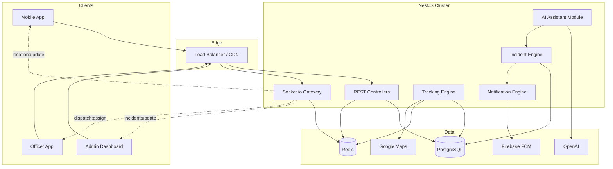

# 4DS Solutions Mobile Protection Platform
## System Architecture Document

**Version:** 1.0  
**Target Scale:** 100,000+ concurrent users  
**Architecture Style:** Multi-tenant SaaS, event-driven micro-modules within a modular monolith (Phase 1), extractable services (Phase 2+)

---

## 1. Executive Summary

4DS Solutions is a commercial mobile protection SaaS connecting end-users, family members, dispatch operators, and field officers through real-time GPS tracking, panic response, theft recovery, and AI-assisted emergency guidance. The platform is designed as a **multi-tenant B2B2C** system where security companies (tenants) white-label or operate branded instances for their subscriber base.

### Design Principles

| Principle | Implementation |
|-----------|----------------|
| Tenant isolation | Row-level security + `tenant_id` on all domain tables; schema-per-tenant optional at enterprise tier |
| Real-time first | Socket.io rooms per tenant/incident; Redis pub/sub for horizontal WebSocket scaling |
| Offline resilience | Mobile queue for panic/location events; idempotent API with client-generated UUIDs |
| Audit everything | Immutable incident timeline; append-only tracking history partitions |
| Security by default | JWT + refresh rotation, RBAC, field-level encryption for PII, rate limiting per tenant |

---

## 2. High-Level System Architecture

```
┌─────────────────────────────────────────────────────────────────────────────────┐
│                              CLIENT LAYER                                        │
├──────────────────────┬──────────────────────────┬───────────────────────────────┤
│  React Native App    │  Next.js Admin Dashboard │  Officer Dispatch App (RN)    │
│  (iOS / Android)     │  (Control Room + Ops)    │  (Future: dedicated build)    │
└──────────┬───────────┴────────────┬─────────────┴───────────────┬───────────────┘
           │                        │                             │
           │ HTTPS/WSS              │ HTTPS/WSS                   │ HTTPS/WSS
           ▼                        ▼                             ▼
┌─────────────────────────────────────────────────────────────────────────────────┐
│                         API GATEWAY / LOAD BALANCER                              │
│                    (NGINX / AWS ALB / Cloudflare)                                │
│         TLS termination · Rate limiting · WAF · Tenant routing                   │
└─────────────────────────────────────────────────────────────────────────────────┘
           │                        │                             │
           ▼                        ▼                             ▼
┌─────────────────────────────────────────────────────────────────────────────────┐
│                    NESTJS APPLICATION CLUSTER (Stateless)                        │
├─────────────────────────────────────────────────────────────────────────────────┤
│  ┌─────────────┐ ┌─────────────┐ ┌─────────────┐ ┌─────────────┐ ┌───────────┐ │
│  │ Auth Module │ │ User Module │ │ Tracking    │ │ Incident    │ │ Dispatch  │ │
│  │             │ │             │ │ Engine      │ │ Engine      │ │ Module    │ │
│  └─────────────┘ └─────────────┘ └─────────────┘ └─────────────┘ └───────────┘ │
│  ┌─────────────┐ ┌─────────────┐ ┌─────────────┐ ┌─────────────┐ ┌───────────┐ │
│  │ Notification│ │ Subscription│ │ Family      │ │ Messaging   │ │ AI        │ │
│  │ Engine      │ │ Module      │ │ Module      │ │ Module      │ │ Assistant │ │
│  └─────────────┘ └─────────────┘ └─────────────┘ └─────────────┘ └───────────┘ │
│  ┌─────────────┐ ┌─────────────┐ ┌─────────────────────────────────────────┐  │
│  │ WebSocket   │ │ Tenant      │ │ Shared: Guards, Interceptors, Pipes, DTOs │  │
│  │ Gateway     │ │ Middleware  │ │ Event Bus (NestJS EventEmitter / BullMQ)│  │
│  └─────────────┘ └─────────────┘ └─────────────────────────────────────────┘  │
└─────────────────────────────────────────────────────────────────────────────────┘
           │              │              │              │              │
           ▼              ▼              ▼              ▼              ▼
┌──────────────┐ ┌──────────────┐ ┌──────────────┐ ┌──────────────┐ ┌────────────┐
│ PostgreSQL   │ │ Redis        │ │ Firebase     │ │ Google Maps  │ │ OpenAI API │
│ (Primary +   │ │ (Cache,      │ │ Cloud        │ │ Platform API │ │            │
│  Read        │ │  Pub/Sub,    │ │ Messaging    │ │              │ │            │
│  Replicas)   │ │  Sessions)   │ │              │ │              │ │            │
└──────────────┘ └──────────────┘ └──────────────┘ └──────────────┘ └────────────┘
           │
           ▼
┌──────────────────────────────────────────────────────────────────────────────────┐
│ BACKGROUND WORKERS (BullMQ)                                                     │
│  · Tracking aggregation  · Notification delivery  · Subscription webhooks         │
│  · Incident SLA timers   · Analytics rollups      · AI conversation archival    │
└──────────────────────────────────────────────────────────────────────────────────┘
```

### Mermaid — Request & Real-Time Flow



---

## 3. Monorepo Folder Structure

```
4ds-solutions-platform/
│
├── apps/
│   ├── mobile/                          # React Native (Expo bare or RN CLI)
│   │   ├── android/
│   │   ├── ios/
│   │   ├── src/
│   │   │   ├── app/                     # Navigation root (React Navigation)
│   │   │   ├── features/
│   │   │   │   ├── auth/
│   │   │   │   ├── panic/
│   │   │   │   ├── tracking/
│   │   │   │   ├── family/
│   │   │   │   ├── theft/
│   │   │   │   ├── contacts/
│   │   │   │   ├── messaging/
│   │   │   │   ├── incidents/
│   │   │   │   ├── profile/
│   │   │   │   └── ai-assistant/
│   │   │   ├── shared/
│   │   │   │   ├── components/
│   │   │   │   ├── hooks/
│   │   │   │   ├── services/            # API, socket, location, push
│   │   │   │   ├── store/               # Zustand or Redux Toolkit
│   │   │   │   ├── types/
│   │   │   │   └── utils/
│   │   │   └── config/
│   │   ├── assets/
│   │   └── package.json
│   │
│   ├── admin/                           # Next.js 14+ App Router
│   │   ├── src/
│   │   │   ├── app/
│   │   │   │   ├── (auth)/
│   │   │   │   ├── (dashboard)/
│   │   │   │   │   ├── control-room/
│   │   │   │   │   ├── incidents/
│   │   │   │   │   ├── theft-recovery/
│   │   │   │   │   ├── users/
│   │   │   │   │   ├── officers/
│   │   │   │   │   ├── dispatch/
│   │   │   │   │   ├── subscriptions/
│   │   │   │   │   └── analytics/
│   │   │   │   └── api/                 # BFF routes if needed
│   │   │   ├── components/
│   │   │   │   ├── maps/                # Google Maps React
│   │   │   │   ├── charts/
│   │   │   │   └── ui/
│   │   │   ├── hooks/
│   │   │   ├── lib/
│   │   │   │   ├── api-client.ts
│   │   │   │   └── socket-client.ts
│   │   │   ├── stores/
│   │   │   └── types/
│   │   ├── public/
│   │   └── package.json
│   │
│   └── api/                             # NestJS Backend
│       ├── src/
│       │   ├── main.ts
│       │   ├── app.module.ts
│       │   ├── common/
│       │   │   ├── decorators/
│       │   │   ├── filters/
│       │   │   ├── guards/
│       │   │   ├── interceptors/
│       │   │   ├── pipes/
│       │   │   ├── middleware/
│       │   │   └── utils/
│       │   ├── config/
│       │   ├── database/
│       │   │   └── prisma.service.ts
│       │   ├── modules/
│       │   │   ├── auth/
│       │   │   ├── tenants/
│       │   │   ├── users/
│       │   │   ├── officers/
│       │   │   ├── devices/
│       │   │   ├── tracking/
│       │   │   ├── incidents/
│       │   │   ├── dispatches/
│       │   │   ├── families/
│       │   │   ├── emergency-contacts/
│       │   │   ├── notifications/
│       │   │   ├── messaging/
│       │   │   ├── subscriptions/
│       │   │   ├── analytics/
│       │   │   ├── ai-assistant/
│       │   │   └── websocket/
│       │   └── workers/                 # BullMQ processors
│       ├── prisma/
│       │   ├── schema.prisma
│       │   ├── migrations/
│       │   └── seeds/
│       ├── test/
│       └── package.json
│
├── packages/
│   ├── shared-types/                    # TypeScript contracts (API DTOs, enums)
│   ├── shared-validation/               # Zod schemas shared across apps
│   ├── eslint-config/
│   └── tsconfig/
│
├── infrastructure/
│   ├── docker/
│   │   ├── Dockerfile.api
│   │   ├── Dockerfile.admin
│   │   └── docker-compose.yml           # Local dev stack
│   ├── terraform/                       # AWS/GCP IaC
│   │   ├── modules/
│   │   └── environments/
│   │       ├── staging/
│   │       └── production/
│   └── k8s/                             # Kubernetes manifests (scale-out)
│
├── docs/
│   ├── ARCHITECTURE.md                  # This document
│   ├── DATABASE_SCHEMA.md
│   ├── API_SPECIFICATION.md
│   └── DEVELOPMENT_ROADMAP.md
│
├── .github/
│   └── workflows/                       # CI/CD pipelines
│
├── package.json                         # Turborepo / pnpm workspaces root
├── turbo.json
├── pnpm-workspace.yaml
└── README.md
```

---

## 4. Multi-Tenant Architecture

### Tenant Model

```
Platform (Super Admin)
    └── Tenant (Security Company / Brand)
            ├── Subscription Plan (limits: users, officers, features)
            ├── Admin Users (control room staff)
            ├── Officers (field responders)
            └── End Users (subscribers + family members)
```

### Isolation Strategy (Recommended: Shared DB, Row-Level)

| Layer | Strategy |
|-------|----------|
| Database | `tenant_id` UUID on every table; composite indexes `(tenant_id, ...)` |
| API | `TenantGuard` extracts tenant from JWT claim or subdomain |
| WebSocket | Room naming: `tenant:{id}`, `incident:{id}`, `user:{id}` |
| Cache | Redis key prefix: `t:{tenantId}:...` |
| Files | S3 bucket prefix per tenant |
| Rate limits | Per-tenant token bucket in Redis |

### Tenant Resolution

1. **JWT claim:** `tenant_id` embedded at login (primary)
2. **Subdomain:** `acme.4ds.solutions` → tenant lookup (admin dashboard)
3. **Header:** `X-Tenant-ID` for service-to-service (internal only)

### Role-Based Access Control (RBAC)

| Role | Scope | Capabilities |
|------|-------|------------|
| `SUPER_ADMIN` | Platform | All tenants, billing, system config |
| `TENANT_ADMIN` | Tenant | Full tenant ops, user/officer management |
| `DISPATCHER` | Tenant | Control room, dispatch, incidents |
| `OFFICER` | Tenant | Assigned dispatches, location broadcast |
| `USER` | Self | Panic, tracking, family, profile |
| `FAMILY_MEMBER` | Linked user | View-only tracking of linked member |

---

## 5. Core Engine Designs

### 5.1 Tracking Engine

**Ingestion path:** Mobile → WebSocket `location:update` → validate → Redis GEOADD → batch insert PostgreSQL (every 30s or 50m movement)

**Storage strategy for scale:**
- **Hot:** Redis GEO + latest position hash per user (`t:{tid}:loc:{uid}`)
- **Warm:** `tracking_history` partitioned monthly by `recorded_at`
- **Cold:** Archive partitions >90 days to S3 Parquet

**Geospatial queries:** PostGIS `ST_DWithin` for nearest officer; Redis GEO for sub-second hot queries

### 5.2 Incident Engine

State machine:

```
DRAFT → ACTIVE → DISPATCHED → EN_ROUTE → ON_SCENE → RESOLVED → CLOSED
                  ↓                              ↓
              ESCALATED                      CANCELLED
```

Each transition appends to `incident_timeline` (immutable). SLA timers via BullMQ delayed jobs.

**Incident types:** `PANIC`, `THEFT`, `MEDICAL`, `FIRE`, `ASSAULT`, `OTHER`

### 5.3 Notification Engine

| Channel | Use Case |
|---------|----------|
| FCM Push | Panic alerts, dispatch updates, family notifications |
| SMS (Twilio) | Critical escalation fallback |
| Email (SendGrid) | Receipts, subscription, incident summaries |
| In-app | Messaging module + notification inbox |
| WebSocket | Real-time dashboard updates |

Delivery pipeline: Event → `notifications` queue → template render → provider dispatch → delivery status webhook

### 5.4 Dispatch Engine — Nearest Officer Algorithm

```
1. Get incident coordinates
2. Query officers WHERE status = AVAILABLE AND tenant_id = X
3. Redis GEOSEARCH radius 50km (expand if none)
4. Score = (distance × 0.6) + (response_time_avg × 0.3) + (workload × 0.1)
5. Assign top officer → create Dispatch record → notify via FCM + WebSocket
6. Start response_time timer
```

### 5.5 AI Assistant Module

Isolated NestJS module with:
- **Conversation context:** User profile, active incident, location, emergency contacts
- **Tool calling:** `create_incident`, `escalate_to_dispatch`, `get_safety_guidance`, `notify_emergency_contact`
- **Guardrails:** PII redaction in logs, max tokens, crisis keyword detection → auto-escalation
- **Persistence:** `ai_conversations` + `ai_messages` tables

---

## 6. WebSocket Events

### Namespace: `/realtime`

| Event (Client → Server) | Payload | Action |
|-------------------------|---------|--------|
| `location:update` | `{ lat, lng, accuracy, speed, heading, battery }` | Update position |
| `panic:trigger` | `{ clientIncidentId, lat, lng }` | Create panic incident |
| `incident:subscribe` | `{ incidentId }` | Join incident room |
| `dispatch:accept` | `{ dispatchId }` | Officer accepts |
| `dispatch:status` | `{ dispatchId, status }` | Officer status update |
| `message:send` | `{ conversationId, content }` | Chat message |
| `typing:start/stop` | `{ conversationId }` | Typing indicators |

| Event (Server → Client) | Recipients |
|-------------------------|------------|
| `location:updated` | Family members, dispatchers |
| `incident:created` | Dispatchers, assigned officers |
| `incident:updated` | All incident subscribers |
| `dispatch:assigned` | Officer, user, dispatchers |
| `officer:location` | Dispatchers, active incident participants |
| `notification:new` | Target user |
| `ai:response` | Requesting user |

### Socket.io Scaling

Redis Adapter (`@socket.io/redis-adapter`) + sticky sessions on load balancer.

---

## 7. Security Architecture

| Concern | Solution |
|---------|----------|
| Authentication | JWT access (15min) + refresh token (7d, rotated, stored hashed) |
| Mobile | Certificate pinning, biometric unlock for panic |
| API | Helmet, CORS whitelist, `@nestjs/throttler` per IP + tenant |
| PII | AES-256-GCM for phone, address at rest |
| Audit | `audit_logs` table for admin actions |
| Panic | Idempotent `client_incident_id`; works with degraded connectivity |
| GDPR | Data export endpoint, right-to-erasure cascade |

---

## 8. Scalability Targets (100k+ Users)

| Component | Strategy |
|-----------|----------|
| API servers | Horizontal pod autoscaling (CPU 70%) |
| WebSocket | Dedicated WS nodes, Redis adapter, 10k connections/node |
| PostgreSQL | Primary + 2 read replicas; PgBouncer connection pooling |
| Tracking writes | Batch inserts, monthly partitions, async aggregation |
| Redis | Cluster mode, 3+ nodes |
| CDN | Static assets for admin dashboard |
| Multi-region | Active-passive DB; Redis Global Datastore (future) |

**Estimated capacity (single region, production config):**
- 100k registered users
- 15k concurrent WebSocket connections
- 5k location updates/second (batched to ~500 DB writes/sec)

---

## 9. External Integrations

| Service | Purpose |
|---------|---------|
| Firebase Cloud Messaging | Push notifications (iOS APNs via FCM) |
| Google Maps Platform | Geocoding, directions, map tiles (admin + mobile) |
| OpenAI API | GPT-4o for AI assistant with function calling |
| Stripe | Subscription billing (webhooks → subscription module) |
| Twilio | SMS fallback for critical alerts |
| SendGrid | Transactional email |
| S3 + CloudFront | Media storage (theft photos, avatars) |

---

## 10. Observability

- **Logging:** Structured JSON (Pino) → Datadog / CloudWatch
- **Metrics:** Prometheus + Grafana (request latency, WS connections, incident rate)
- **Tracing:** OpenTelemetry → Jaeger
- **Alerting:** PagerDuty for incident SLA breaches, API error rate >1%
- **Health:** `/health`, `/ready` (DB + Redis checks)

---

## 11. Deployment Topology (Production)

```
                    ┌─────────────┐
                    │ Cloudflare  │
                    │ DNS + WAF   │
                    └──────┬──────┘
                           │
              ┌────────────┴────────────┐
              │                         │
        ┌─────▼─────┐            ┌──────▼──────┐
        │ Admin CDN │            │ API ALB     │
        │ (Vercel/  │            │ (K8s/EKS)   │
        │  S3+CF)   │            └──────┬──────┘
        └───────────┘                   │
                         ┌──────────────┼──────────────┐
                         │              │              │
                    ┌────▼────┐   ┌─────▼────┐   ┌────▼────┐
                    │ API x N │   │ WS x N   │   │Worker xN│
                    └────┬────┘   └─────┬────┘   └────┬────┘
                         │              │              │
                         └──────────────┼──────────────┘
                                        │
                         ┌──────────────┼──────────────┐
                         │              │              │
                    ┌────▼────┐   ┌─────▼────┐   ┌────▼────┐
                    │ RDS PG  │   │ Redis    │   │ S3      │
                    │ Primary │   │ Cluster  │   │         │
                    │ +Replica│   │          │   │         │
                    └─────────┘   └──────────┘   └─────────┘
```

---

## Related Documents

- [DATABASE_SCHEMA.md](./DATABASE_SCHEMA.md) — Full entity model and Prisma-oriented schema
- [API_SPECIFICATION.md](./API_SPECIFICATION.md) — REST endpoints and WebSocket contracts
- [DEVELOPMENT_ROADMAP.md](./DEVELOPMENT_ROADMAP.md) — Phased implementation plan
