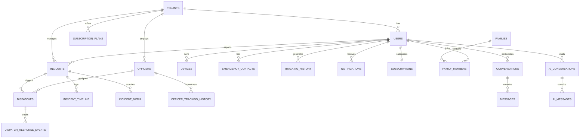

# Database Schema Design
## 4DS Solutions Mobile Protection Platform

**ORM:** Prisma  
**Database:** PostgreSQL 16+ with PostGIS extension  
**Convention:** All tables include `tenant_id` unless platform-global. UUIDs for all primary keys.

---

## Entity Relationship Overview



---

## Enums

```prisma
enum UserRole {
  USER
  FAMILY_MEMBER
  DISPATCHER
  TENANT_ADMIN
  SUPER_ADMIN
}

enum UserStatus {
  ACTIVE
  SUSPENDED
  PENDING_VERIFICATION
  DELETED
}

enum OfficerStatus {
  AVAILABLE
  BUSY
  OFF_DUTY
  ON_BREAK
}

enum DevicePlatform {
  IOS
  ANDROID
}

enum IncidentType {
  PANIC
  THEFT
  MEDICAL
  FIRE
  ASSAULT
  OTHER
}

enum IncidentStatus {
  DRAFT
  ACTIVE
  DISPATCHED
  EN_ROUTE
  ON_SCENE
  RESOLVED
  CLOSED
  CANCELLED
  ESCALATED
}

enum IncidentPriority {
  LOW
  MEDIUM
  HIGH
  CRITICAL
}

enum DispatchStatus {
  PENDING
  ASSIGNED
  ACCEPTED
  DECLINED
  EN_ROUTE
  ON_SCENE
  COMPLETED
  CANCELLED
}

enum SubscriptionStatus {
  TRIALING
  ACTIVE
  PAST_DUE
  CANCELLED
  EXPIRED
}

enum NotificationType {
  PANIC_ALERT
  INCIDENT_UPDATE
  DISPATCH_ASSIGNED
  FAMILY_ALERT
  THEFT_ALERT
  SUBSCRIPTION
  SYSTEM
  MESSAGE
}

enum NotificationChannel {
  PUSH
  SMS
  EMAIL
  IN_APP
}

enum MessageType {
  TEXT
  IMAGE
  LOCATION
  SYSTEM
}

enum AiMessageRole {
  USER
  ASSISTANT
  SYSTEM
  TOOL
}
```

---

## Core Tables

### tenants

Platform customers (security companies).

| Column | Type | Constraints | Description |
|--------|------|-------------|-------------|
| id | UUID | PK | |
| name | VARCHAR(255) | NOT NULL | Company name |
| slug | VARCHAR(100) | UNIQUE, NOT NULL | Subdomain identifier |
| logo_url | TEXT | | Branding |
| primary_color | VARCHAR(7) | | Hex color |
| contact_email | VARCHAR(255) | NOT NULL | |
| contact_phone | VARCHAR(20) | | |
| settings | JSONB | DEFAULT '{}' | Feature flags, config |
| is_active | BOOLEAN | DEFAULT true | |
| created_at | TIMESTAMPTZ | DEFAULT now() | |
| updated_at | TIMESTAMPTZ | | |

**Indexes:** `slug`, `is_active`

---

### users

End users, admins, and dispatchers (officers are separate table).

| Column | Type | Constraints | Description |
|--------|------|-------------|-------------|
| id | UUID | PK | |
| tenant_id | UUID | FK → tenants, NOT NULL | |
| email | VARCHAR(255) | NOT NULL | |
| phone | VARCHAR(255) | ENCRYPTED | E.164 format |
| password_hash | VARCHAR(255) | | Null for OAuth-only |
| first_name | VARCHAR(100) | NOT NULL | |
| last_name | VARCHAR(100) | NOT NULL | |
| avatar_url | TEXT | | |
| role | UserRole | NOT NULL | |
| status | UserStatus | DEFAULT PENDING_VERIFICATION | |
| email_verified_at | TIMESTAMPTZ | | |
| phone_verified_at | TIMESTAMPTZ | | |
| last_login_at | TIMESTAMPTZ | | |
| last_known_lat | DECIMAL(10,8) | | Denormalized hot position |
| last_known_lng | DECIMAL(11,8) | | |
| last_location_at | TIMESTAMPTZ | | |
| tracking_enabled | BOOLEAN | DEFAULT true | |
| metadata | JSONB | DEFAULT '{}' | |
| created_at | TIMESTAMPTZ | DEFAULT now() | |
| updated_at | TIMESTAMPTZ | | |
| deleted_at | TIMESTAMPTZ | | Soft delete |

**Indexes:** `(tenant_id, email)` UNIQUE, `(tenant_id, status)`, `(tenant_id, last_location_at)`  
**Partial index:** `(tenant_id) WHERE status = 'ACTIVE' AND tracking_enabled = true` for live map

---

### officers

Field responders managed by tenant.

| Column | Type | Constraints | Description |
|--------|------|-------------|-------------|
| id | UUID | PK | |
| tenant_id | UUID | FK → tenants, NOT NULL | |
| employee_id | VARCHAR(50) | | Internal badge number |
| email | VARCHAR(255) | NOT NULL | |
| phone | VARCHAR(255) | ENCRYPTED | |
| password_hash | VARCHAR(255) | NOT NULL | |
| first_name | VARCHAR(100) | NOT NULL | |
| last_name | VARCHAR(100) | NOT NULL | |
| avatar_url | TEXT | | |
| status | OfficerStatus | DEFAULT OFF_DUTY | |
| current_lat | DECIMAL(10,8) | | |
| current_lng | DECIMAL(11,8) | | |
| location_updated_at | TIMESTAMPTZ | | |
| vehicle_type | VARCHAR(50) | | car, motorcycle, foot |
| vehicle_plate | VARCHAR(20) | | |
| avg_response_time_sec | INTEGER | DEFAULT 0 | Rolling average |
| total_dispatches | INTEGER | DEFAULT 0 | |
| rating | DECIMAL(3,2) | | 0.00–5.00 |
| shift_start | TIME | | |
| shift_end | TIME | | |
| is_active | BOOLEAN | DEFAULT true | |
| created_at | TIMESTAMPTZ | DEFAULT now() | |
| updated_at | TIMESTAMPTZ | | |

**Indexes:** `(tenant_id, status)`, `(tenant_id, email)` UNIQUE  
**PostGIS:** `location GEOGRAPHY(POINT, 4326)` generated from lat/lng for spatial queries

---

### devices

Mobile devices registered for push and tracking.

| Column | Type | Constraints | Description |
|--------|------|-------------|-------------|
| id | UUID | PK | |
| tenant_id | UUID | FK → tenants | |
| user_id | UUID | FK → users, NOT NULL | |
| device_uuid | VARCHAR(255) | NOT NULL | Client-generated stable ID |
| platform | DevicePlatform | NOT NULL | |
| fcm_token | TEXT | | Firebase token |
| app_version | VARCHAR(20) | | |
| os_version | VARCHAR(20) | | |
| model | VARCHAR(100) | | |
| is_primary | BOOLEAN | DEFAULT false | |
| last_active_at | TIMESTAMPTZ | | |
| created_at | TIMESTAMPTZ | DEFAULT now() | |
| updated_at | TIMESTAMPTZ | | |

**Indexes:** `(user_id, device_uuid)` UNIQUE, `(tenant_id, fcm_token)`

---

### emergency_contacts

| Column | Type | Constraints | Description |
|--------|------|-------------|-------------|
| id | UUID | PK | |
| tenant_id | UUID | FK → tenants | |
| user_id | UUID | FK → users, NOT NULL | |
| name | VARCHAR(150) | NOT NULL | |
| phone | VARCHAR(255) | ENCRYPTED, NOT NULL | |
| email | VARCHAR(255) | | |
| relationship | VARCHAR(50) | | spouse, parent, etc. |
| priority | SMALLINT | DEFAULT 1 | 1 = highest |
| notify_on_panic | BOOLEAN | DEFAULT true | |
| notify_on_theft | BOOLEAN | DEFAULT true | |
| created_at | TIMESTAMPTZ | DEFAULT now() | |
| updated_at | TIMESTAMPTZ | | |

**Indexes:** `(user_id, priority)`

---

### families

Family groups for shared tracking.

| Column | Type | Constraints | Description |
|--------|------|-------------|-------------|
| id | UUID | PK | |
| tenant_id | UUID | FK → tenants | |
| name | VARCHAR(150) | NOT NULL | "Smith Family" |
| owner_user_id | UUID | FK → users, NOT NULL | Primary account holder |
| invite_code | VARCHAR(20) | UNIQUE | For joining |
| max_members | SMALLINT | DEFAULT 6 | Plan-dependent |
| created_at | TIMESTAMPTZ | DEFAULT now() | |
| updated_at | TIMESTAMPTZ | | |

---

### family_members

| Column | Type | Constraints | Description |
|--------|------|-------------|-------------|
| id | UUID | PK | |
| family_id | UUID | FK → families, NOT NULL | |
| user_id | UUID | FK → users, NOT NULL | |
| role | VARCHAR(20) | DEFAULT 'member' | owner, member |
| can_view_location | BOOLEAN | DEFAULT true | |
| can_receive_alerts | BOOLEAN | DEFAULT true | |
| nickname | VARCHAR(50) | | |
| joined_at | TIMESTAMPTZ | DEFAULT now() | |

**Indexes:** `(family_id, user_id)` UNIQUE

---

### subscription_plans

Tenant-defined or platform-default plans.

| Column | Type | Constraints | Description |
|--------|------|-------------|-------------|
| id | UUID | PK | |
| tenant_id | UUID | FK → tenants | Null = platform default |
| name | VARCHAR(100) | NOT NULL | |
| slug | VARCHAR(50) | NOT NULL | |
| description | TEXT | | |
| price_monthly_cents | INTEGER | NOT NULL | |
| price_yearly_cents | INTEGER | | |
| max_family_members | SMALLINT | DEFAULT 4 | |
| features | JSONB | DEFAULT '{}' | Feature flags |
| stripe_price_id_monthly | VARCHAR(100) | | |
| stripe_price_id_yearly | VARCHAR(100) | | |
| is_active | BOOLEAN | DEFAULT true | |
| created_at | TIMESTAMPTZ | DEFAULT now() | |

---

### subscriptions

| Column | Type | Constraints | Description |
|--------|------|-------------|-------------|
| id | UUID | PK | |
| tenant_id | UUID | FK → tenants | |
| user_id | UUID | FK → users, NOT NULL | |
| plan_id | UUID | FK → subscription_plans | |
| status | SubscriptionStatus | NOT NULL | |
| stripe_customer_id | VARCHAR(100) | | |
| stripe_subscription_id | VARCHAR(100) | | |
| current_period_start | TIMESTAMPTZ | | |
| current_period_end | TIMESTAMPTZ | | |
| trial_end | TIMESTAMPTZ | | |
| cancelled_at | TIMESTAMPTZ | | |
| created_at | TIMESTAMPTZ | DEFAULT now() | |
| updated_at | TIMESTAMPTZ | | |

**Indexes:** `(user_id)` UNIQUE active, `(tenant_id, status)`, `stripe_subscription_id`

---

### incidents

| Column | Type | Constraints | Description |
|--------|------|-------------|-------------|
| id | UUID | PK | |
| tenant_id | UUID | FK → tenants, NOT NULL | |
| user_id | UUID | FK → users, NOT NULL | Reporter |
| client_incident_id | UUID | UNIQUE | Idempotency key from mobile |
| type | IncidentType | NOT NULL | |
| status | IncidentStatus | DEFAULT ACTIVE | |
| priority | IncidentPriority | DEFAULT HIGH | |
| title | VARCHAR(255) | | |
| description | TEXT | | |
| lat | DECIMAL(10,8) | NOT NULL | |
| lng | DECIMAL(11,8) | NOT NULL | |
| address | TEXT | | Reverse geocoded |
| theft_vehicle_make | VARCHAR(50) | | Theft-specific |
| theft_vehicle_model | VARCHAR(50) | | |
| theft_vehicle_color | VARCHAR(30) | | |
| theft_vehicle_plate | VARCHAR(20) | | |
| theft_recovery_mode | BOOLEAN | DEFAULT false | |
| assigned_officer_id | UUID | FK → officers | |
| resolved_at | TIMESTAMPTZ | | |
| resolution_notes | TEXT | | |
| response_time_sec | INTEGER | | Time to first dispatch |
| total_duration_sec | INTEGER | | Creation to resolution |
| metadata | JSONB | DEFAULT '{}' | |
| created_at | TIMESTAMPTZ | DEFAULT now() | |
| updated_at | TIMESTAMPTZ | | |

**Indexes:** `(tenant_id, status)`, `(tenant_id, created_at DESC)`, `(user_id)`, `(tenant_id, theft_recovery_mode) WHERE theft_recovery_mode = true`  
**PostGIS:** `location GEOGRAPHY(POINT, 4326)`

---

### incident_timeline

Immutable audit trail per incident.

| Column | Type | Constraints | Description |
|--------|------|-------------|-------------|
| id | UUID | PK | |
| incident_id | UUID | FK → incidents, NOT NULL | |
| actor_type | VARCHAR(20) | NOT NULL | user, officer, dispatcher, system, ai |
| actor_id | UUID | | |
| event | VARCHAR(100) | NOT NULL | status_changed, note_added, etc. |
| from_status | IncidentStatus | | |
| to_status | IncidentStatus | | |
| payload | JSONB | DEFAULT '{}' | |
| created_at | TIMESTAMPTZ | DEFAULT now() | |

**Indexes:** `(incident_id, created_at)`

---

### incident_media

Photos/evidence for theft and incidents.

| Column | Type | Constraints | Description |
|--------|------|-------------|-------------|
| id | UUID | PK | |
| incident_id | UUID | FK → incidents | |
| uploaded_by | UUID | NOT NULL | |
| file_url | TEXT | NOT NULL | S3 URL |
| file_type | VARCHAR(50) | | image/jpeg |
| created_at | TIMESTAMPTZ | DEFAULT now() | |

---

### dispatches

Officer assignments to incidents.

| Column | Type | Constraints | Description |
|--------|------|-------------|-------------|
| id | UUID | PK | |
| tenant_id | UUID | FK → tenants | |
| incident_id | UUID | FK → incidents, NOT NULL | |
| officer_id | UUID | FK → officers, NOT NULL | |
| status | DispatchStatus | DEFAULT PENDING | |
| assigned_by | UUID | | Dispatcher user ID |
| assignment_method | VARCHAR(20) | | auto, manual |
| distance_at_assignment_m | INTEGER | | |
| estimated_eta_sec | INTEGER | | |
| accepted_at | TIMESTAMPTZ | | |
| en_route_at | TIMESTAMPTZ | | |
| on_scene_at | TIMESTAMPTZ | | |
| completed_at | TIMESTAMPTZ | | |
| response_time_sec | INTEGER | | accepted_at - created_at |
| notes | TEXT | | |
| created_at | TIMESTAMPTZ | DEFAULT now() | |
| updated_at | TIMESTAMPTZ | | |

**Indexes:** `(incident_id)`, `(officer_id, status)`, `(tenant_id, status, created_at)`

---

### dispatch_response_events

Granular response time tracking.

| Column | Type | Constraints | Description |
|--------|------|-------------|-------------|
| id | UUID | PK | |
| dispatch_id | UUID | FK → dispatches | |
| event | VARCHAR(50) | NOT NULL | assigned, accepted, en_route, on_scene |
| lat | DECIMAL(10,8) | | Officer position at event |
| lng | DECIMAL(11,8) | | |
| recorded_at | TIMESTAMPTZ | DEFAULT now() | |

---

### tracking_history

**Partitioned by month on `recorded_at`.**

| Column | Type | Constraints | Description |
|--------|------|-------------|-------------|
| id | UUID | PK | |
| tenant_id | UUID | FK → tenants | |
| user_id | UUID | FK → users, NOT NULL | |
| device_id | UUID | FK → devices | |
| lat | DECIMAL(10,8) | NOT NULL | |
| lng | DECIMAL(11,8) | NOT NULL | |
| accuracy_m | REAL | | |
| altitude_m | REAL | | |
| speed_mps | REAL | | |
| heading | REAL | | |
| battery_pct | SMALLINT | | |
| recorded_at | TIMESTAMPTZ | NOT NULL | Client timestamp |
| received_at | TIMESTAMPTZ | DEFAULT now() | Server timestamp |

**Indexes:** `(user_id, recorded_at DESC)`, `(tenant_id, recorded_at)`  
**Retention:** 90 days hot → archive to S3

---

### officer_tracking_history

Same structure as `tracking_history` but for officers. Partitioned monthly.

---

### notifications

| Column | Type | Constraints | Description |
|--------|------|-------------|-------------|
| id | UUID | PK | |
| tenant_id | UUID | FK → tenants | |
| user_id | UUID | FK → users | |
| officer_id | UUID | FK → officers | |
| type | NotificationType | NOT NULL | |
| channel | NotificationChannel | NOT NULL | |
| title | VARCHAR(255) | NOT NULL | |
| body | TEXT | NOT NULL | |
| data | JSONB | DEFAULT '{}' | Deep link payload |
| incident_id | UUID | FK → incidents | |
| is_read | BOOLEAN | DEFAULT false | |
| sent_at | TIMESTAMPTZ | | |
| delivered_at | TIMESTAMPTZ | | |
| failed_at | TIMESTAMPTZ | | |
| failure_reason | TEXT | | |
| created_at | TIMESTAMPTZ | DEFAULT now() | |

**Indexes:** `(user_id, is_read, created_at DESC)`, `(tenant_id, type, created_at)`

---

### conversations

In-app messaging threads.

| Column | Type | Constraints | Description |
|--------|------|-------------|-------------|
| id | UUID | PK | |
| tenant_id | UUID | FK → tenants | |
| incident_id | UUID | FK → incidents | Optional link |
| type | VARCHAR(20) | DEFAULT 'support' | support, incident, dispatch |
| subject | VARCHAR(255) | | |
| created_at | TIMESTAMPTZ | DEFAULT now() | |
| updated_at | TIMESTAMPTZ | | |

---

### conversation_participants

| Column | Type | Constraints | Description |
|--------|------|-------------|-------------|
| id | UUID | PK | |
| conversation_id | UUID | FK → conversations | |
| user_id | UUID | FK → users | |
| officer_id | UUID | FK → officers | |
| last_read_at | TIMESTAMPTZ | | |
| joined_at | TIMESTAMPTZ | DEFAULT now() | |

---

### messages

| Column | Type | Constraints | Description |
|--------|------|-------------|-------------|
| id | UUID | PK | |
| conversation_id | UUID | FK → conversations | |
| sender_user_id | UUID | FK → users | |
| sender_officer_id | UUID | FK → officers | |
| type | MessageType | DEFAULT TEXT | |
| content | TEXT | NOT NULL | |
| metadata | JSONB | DEFAULT '{}' | |
| created_at | TIMESTAMPTZ | DEFAULT now() | |

**Indexes:** `(conversation_id, created_at)`

---

### ai_conversations

| Column | Type | Constraints | Description |
|--------|------|-------------|-------------|
| id | UUID | PK | |
| tenant_id | UUID | FK → tenants | |
| user_id | UUID | FK → users | |
| incident_id | UUID | FK → incidents | Set if escalated |
| title | VARCHAR(255) | | Auto-generated |
| is_emergency | BOOLEAN | DEFAULT false | |
| escalated_at | TIMESTAMPTZ | | |
| closed_at | TIMESTAMPTZ | | |
| created_at | TIMESTAMPTZ | DEFAULT now() | |

---

### ai_messages

| Column | Type | Constraints | Description |
|--------|------|-------------|-------------|
| id | UUID | PK | |
| conversation_id | UUID | FK → ai_conversations | |
| role | AiMessageRole | NOT NULL | |
| content | TEXT | NOT NULL | |
| tool_calls | JSONB | | OpenAI tool call data |
| tool_results | JSONB | | |
| tokens_used | INTEGER | | |
| created_at | TIMESTAMPTZ | DEFAULT now() | |

---

### refresh_tokens

| Column | Type | Constraints | Description |
|--------|------|-------------|-------------|
| id | UUID | PK | |
| token_hash | VARCHAR(255) | UNIQUE | |
| user_id | UUID | FK → users | |
| officer_id | UUID | FK → officers | |
| device_id | UUID | FK → devices | |
| expires_at | TIMESTAMPTZ | NOT NULL | |
| revoked_at | TIMESTAMPTZ | | |
| created_at | TIMESTAMPTZ | DEFAULT now() | |

---

### audit_logs

| Column | Type | Constraints | Description |
|--------|------|-------------|-------------|
| id | UUID | PK | |
| tenant_id | UUID | | |
| actor_id | UUID | NOT NULL | |
| actor_role | VARCHAR(50) | | |
| action | VARCHAR(100) | NOT NULL | |
| resource_type | VARCHAR(50) | | |
| resource_id | UUID | | |
| ip_address | INET | | |
| user_agent | TEXT | | |
| payload | JSONB | | |
| created_at | TIMESTAMPTZ | DEFAULT now() | |

**Indexes:** `(tenant_id, created_at DESC)`, `(actor_id, created_at)`

---

## Prisma Schema Reference (Condensed)

```prisma
generator client {
  provider        = "prisma-client-js"
  previewFeatures = ["postgresqlExtensions"]
}

datasource db {
  provider   = "postgresql"
  url        = env("DATABASE_URL")
  extensions = [postgis]
}

model Tenant {
  id           String   @id @default(uuid()) @db.Uuid
  name         String
  slug         String   @unique
  logoUrl      String?  @map("logo_url")
  primaryColor String?  @map("primary_color")
  contactEmail String   @map("contact_email")
  contactPhone String?  @map("contact_phone")
  settings     Json     @default("{}")
  isActive     Boolean  @default(true) @map("is_active")
  createdAt    DateTime @default(now()) @map("created_at")
  updatedAt    DateTime @updatedAt @map("updated_at")

  users         User[]
  officers      Officer[]
  incidents     Incident[]
  subscriptions Subscription[]
  plans         SubscriptionPlan[]

  @@map("tenants")
}

model User {
  id              String     @id @default(uuid()) @db.Uuid
  tenantId        String     @map("tenant_id") @db.Uuid
  email           String
  phone           String?
  passwordHash    String?    @map("password_hash")
  firstName       String     @map("first_name")
  lastName        String     @map("last_name")
  avatarUrl       String?    @map("avatar_url")
  role            UserRole
  status          UserStatus @default(PENDING_VERIFICATION)
  lastKnownLat    Decimal?   @map("last_known_lat") @db.Decimal(10, 8)
  lastKnownLng    Decimal?   @map("last_known_lng") @db.Decimal(11, 8)
  lastLocationAt  DateTime?  @map("last_location_at")
  trackingEnabled Boolean    @default(true) @map("tracking_enabled")
  metadata        Json       @default("{}")
  createdAt       DateTime   @default(now()) @map("created_at")
  updatedAt       DateTime   @updatedAt @map("updated_at")
  deletedAt       DateTime?  @map("deleted_at")

  tenant            Tenant             @relation(fields: [tenantId], references: [id])
  devices           Device[]
  emergencyContacts EmergencyContact[]
  incidents         Incident[]
  notifications     Notification[]
  subscription      Subscription?
  familyMemberships FamilyMember[]
  ownedFamilies     Family[]           @relation("FamilyOwner")

  @@unique([tenantId, email])
  @@index([tenantId, status])
  @@map("users")
}

// ... remaining models follow same pattern — see full schema in apps/api/prisma/schema.prisma during implementation
```

---

## Partitioning Strategy

```sql
-- tracking_history partitioned by month
CREATE TABLE tracking_history (
  -- columns as defined above
) PARTITION BY RANGE (recorded_at);

CREATE TABLE tracking_history_2026_06 PARTITION OF tracking_history
  FOR VALUES FROM ('2026-06-01') TO ('2026-07-01');

-- Automated via pg_partman or cron job creating next month's partition
```

---

## Data Retention Policy

| Table | Hot (PostgreSQL) | Archive |
|-------|------------------|---------|
| tracking_history | 90 days | S3 Parquet, 2 years |
| officer_tracking_history | 90 days | S3 Parquet, 2 years |
| notifications | 180 days | Delete |
| ai_messages | 1 year | Anonymize |
| audit_logs | 7 years | Compliance requirement |
| incidents | Permanent | — |

---

## Migration Order (Implementation)

1. `tenants`, `subscription_plans`
2. `users`, `officers`, `refresh_tokens`
3. `devices`, `emergency_contacts`
4. `families`, `family_members`, `subscriptions`
5. `incidents`, `incident_timeline`, `incident_media`
6. `dispatches`, `dispatch_response_events`
7. `tracking_history` (with partitions), `officer_tracking_history`
8. `notifications`
9. `conversations`, `conversation_participants`, `messages`
10. `ai_conversations`, `ai_messages`
11. `audit_logs`
